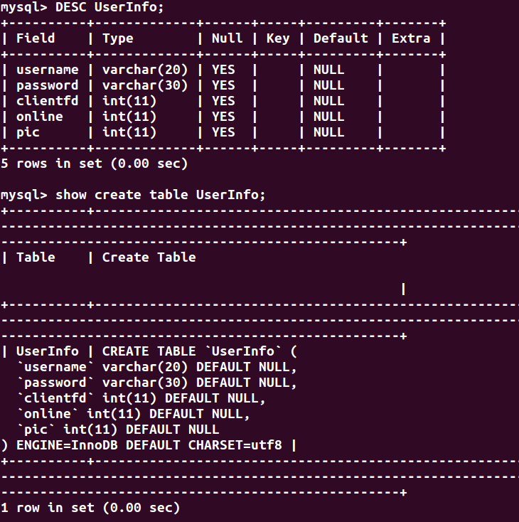

# TCP-ChatRoom V1.0
 - **客户端**

 win10下的客户端

Ubuntu下客户端

聊天室

接收到好友请求

是否同意？拒绝后，发送请求的一方会受到拒绝信息。

更换头像，实时更新，将头像信息回传到服务器。

实时更新好友头像，和状态信息

 - **服务器端**

 服务器后台记录在这里插入图片描述

 

服务器数据库

 - **注意事项**

> - 日志库spdlog需要把其文件夹中的include/spdlog 文件夹放到Linux系统/usr/include 目录下
>
> - 数据库相关函数需要mysql.h头文件，需要Linux系统安装mysql软件
>
> - sudo apt-get install mysql-server
>
> - sudo apt-get install libmysqlclient-dev[开发包，不安装会提示找不到mysql.h头文件]
>
> - 我用的数据库名称叫做ChatRoom，若你的mysql中没有这一数据库，会提示连接数据库失败
>
> - 保存用户信息的表UserInfo的结构及建表语句
>
>   
>
> - 服务器IP为腾讯云服务器IP，这样可以保证公网下的用户都能连接上，测试时要修改为你的本地IP，客户端，服务器端都要改
>
> - 参考项目：[从零开始实现一个聊天室客户端](https://github.com/liu-jianhao/chatRoom)

## TCP-ChatRoom V2.0

- 

- 基于muduo服务器实现的，将业务逻辑将服务逻辑分开，代码结构更加清晰

- USerInfo表的结构图及创建语句

  

- 加入了压力测试代码-ChatRoom_loadtest.cc，可以进行压力测试

- 加入了自动重启服务端程序的Shell脚本-restart.sh,可实现自动重启程序，配合screen 命令，可以实现服务器的常态运行

- **注意事项**

> 2.0版本是在muduo网络库的基础上实现的，首先得安装muduo网络库（吐槽一下，安装起来挺费时的，各种错误警告。。。但是用起来还是挺方便的，很容易就实现了想要的功能）
>
> [muduo网络库](https://github.com/chenshuo/muduo)
>
> [muduo库的安装与使用](https://blog.csdn.net/amoscykl/article/details/83185400)